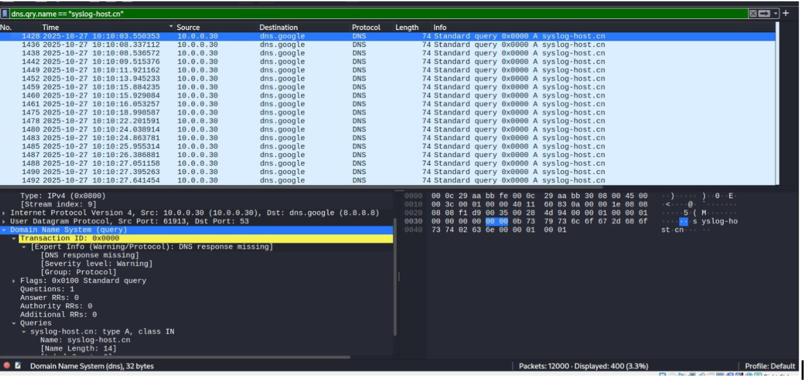
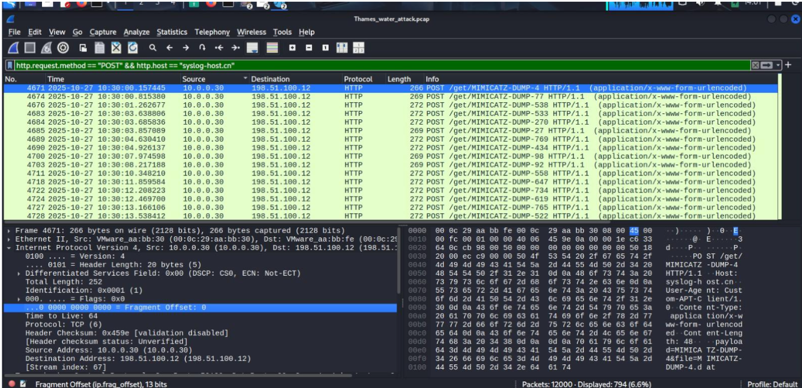
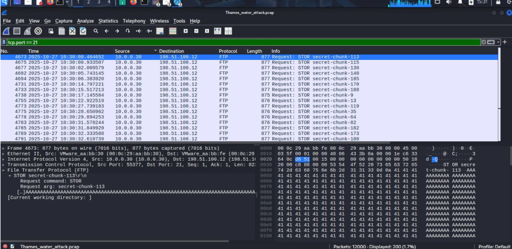
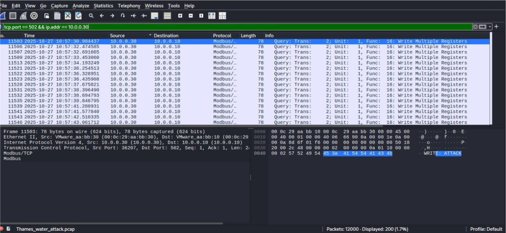

# Industrial Control System Cyber Incident Investigation

## Overview
This project documents an investigation into a simulated cyberattack targeting a water treatment control network using packet capture (PCAP) analysis.

The objective was to reconstruct the attack, identify attacker behaviour, investigate malicious network traffic, and assess the impact on an Industrial Control System (ICS).

## Tools Used

- Wireshark
- WHOIS Lookup
- Protocol Analysis
- TCP Stream Analysis

## Skills Demonstrated

- Network Traffic Analysis
- Incident Response
- Threat Hunting
- ICS Security
- Threat Modelling

## Investigation Summary

The investigation identified:
- TCP SYN reconnaissance
- Phishing activity
- Command-and-Control traffic
- FTP data exfiltration
- Modbus register manipulation

## Screenshots

Screenshots showing key stages of the investigation are included in this repository.
### TCP SYN Reconnaissance

This capture shows repeated TCP SYN packets targeting multiple internal services. The traffic pattern indicates reconnaissance activity used to identify accessible hosts and services before later stages of the attack. Multiple connection attempts were observed against ports including SMB (445), RDP (3389), SSH (22), and Modbus (502), suggesting the attacker was mapping the network for potential entry points.

### Suspicious DNS Queries

This screenshot highlights repeated DNS queries to a suspicious external domain. The abnormal frequency of these requests suggests beaconing behaviour, where a compromised host repeatedly attempts to communicate with an attacker-controlled server. This activity served as an early indicator of command-and-control (C2) communication before malicious HTTP traffic was established.

### Command and Control Communication

This capture shows repeated HTTP POST requests between the compromised internal host and an external server. The communication pattern, combined with references to Mimikatz credential dumps, indicates an active command-and-control channel used by the attacker to transmit stolen credentials and receive instructions while blending into normal web traffic.

.

### FTP Data Exfiltration

This screenshot shows FTP traffic containing repeated STOR commands used to upload files from the compromised host to an external server. The sequential transfer of multiple file fragments suggests structured data exfiltration, allowing sensitive information to be transferred outside the network while avoiding detection.

### Modbus Industrial Control System (ICS) Sabotage

This capture shows repeated Modbus/TCP write requests sent to an industrial control device. The repeated "Write Multiple Registers" commands indicate an attempt to modify PLC register values, potentially affecting critical water treatment operations such as chemical dosing, valve control, or pump management. This represents the final sabotage phase of the attack.

